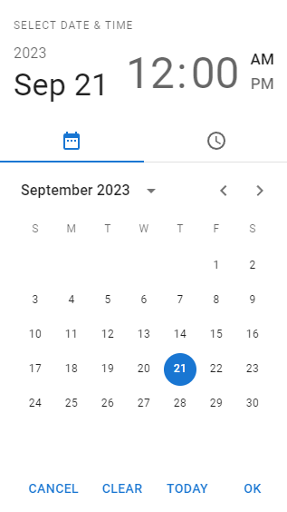

# react-admin-mui-dateinputs

MUI date/time pickers for use in react-admin applications, compatible with react-admin v4 and MUI v5.

## Installation

```
npm install react-admin-mui-dateinputs --save
```

## Usage



This package provides a DateInput, TimeInput, and DateTimeInput based on MUI v5 pickers from the [MUI-X](https://mui.com/x/react-date-pickers/) library, for use in a [react-admin](https://marmelab.com/react-admin/) application.

```jsx
import React from 'react';
import { Create, TextInput, SimpleForm } from 'react-admin';
import { DateTimeInput } from 'react-admin-mui-dateinputs';

export const TestForm = () => {
    const logWhenOpen = val => console.log('Opened!:', value);

    return (
        <Create>
            <SimpleForm>
                <TextInput source="test-title" />
                <DateTimeInput
                    source="test-date-time"
                    label="Date/Time"
                    onOpen={logWhenOpen}
                    toolbarActions={['cancel', 'accept']}
                />
            </SimpleForm>
        </Create>
    );
};
```

These pickers use MUI-X's `LocalizationProvider`, which is supplied their `AdapterDateFns` as a dateAdapter. Dates are formatted as ISO strings by default, though props `parse` and `format` are passed to react-admin's [useInput hook](https://marmelab.com/react-admin/useInput.html), allowing date formats and input values to be configured.

All three inputs accept most react-admin input props, including `validate`, `defaultValue`, `fullWidth`, `helperText`, `sx`, etc., and (obviously) require `source` and `label` to be defined in order to work correctly as form inputs or filters.

Additional functionality can be derived from the prop functions `onOpen` and `onClose`, which are called during their corresponding events. See above example for a simple demonstration.

These inputs use a "fragile controlled" input strategy in which the picker's value is kept in React state while the picker is open, and the corresponding input's value is only updated when the "Accept" button is clicked. To whit; if you don't complete the date/time/datetime picking process, or click "Cancel", the input's value will not be saved. However, clicking "Today" will select the current date/time/datetime, update the input, and close the picker.

The action bar at the bottom of the picker can be configured by passing an array of string values representing the desired buttons/functions. See [MUI-X Custom Components](https://mui.com/x/react-date-pickers/custom-components/) for reference.

I decided to use the Mobile variants of each of MUI's pickers, as I found they provided the best user experience. Let me know if I got this wrong by opening a pull request that exposes the Desktop pickers!

This package is inspired by the previous work of [vascofg](https://github.com/vascofg) and [WiXSL](https://github.com/WiXSL), who had created similar packages for react-admin v2 and v3, respectively.

Lastly, I welcome any and all feedback, especially in the form of pull requests and opened issues.

Thanks!

## Contributing

I welcome opened issues and pull requests! This package was primarily geared towards my particular needs, but I'd love to see it cover more use-cases and become useful to a wider audience.

## License

This library is licensed under the [MIT License](LICENSE).
